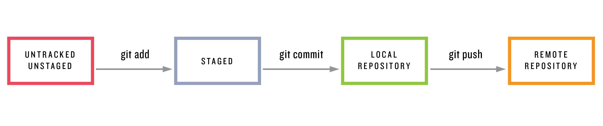

# 1. Basic

* Git 을 사용하는 가장 흔한 방법은, Command Line 을 이용하여 `git` 이라는 프로그램을 호출하는 것이다.
* 이를 통해 우리는 일반적인 디렉토리를, *repository*(저장소) - 줄여서 *repo* 로 바꿔 우리 프로젝트의 변경사항을 추적할 수있다.
* Git 이 어떻게 동작하는지, 어떻게 우리를 도와주는지를 작은 웹사이트 프로젝트를 통해 알아보자.

## 1.1 Installation and setup

* 각 OS별로 Git 을 설치한다.
* `which` 명령어를 통해 실행할 수 있는 `git` 이 존재하는지 확인하자.

```shell
$ which git
/usr/local/bin/git
```

* 다음과 같이 나오지 않는다면, [Git 공식 문서](https://git-scm.com/book/en/v2/Getting-Started-Installing-Git)를 보며 설치하자.
* 프로젝트를 시작하기 앞서서, 한 번만 하면 되는 설정을 몇가지 진행하자. 이것을 *global setup* 부르며, 한 컴퓨터당 한번만 수행하면 되는 설정이라는 뜻이다. (무슨 뜻인지는 지금 걱정하지 말자.)

```shell
$ git config --global user.name "Your Name"
$ git config --global user.email your.email@mail.com
```

* 이 설정들은 Git 이 변경사항을 이름과 이메일로 구분하기 위해 하는 설정이며, 특히 남들과 협업할 때 필요하다.
* 위에서 설장한 이름과 이메일은 남들에게 보여질 것이기 때문에 중요한 개인정보를 담지 않도록 주의!


### Exercises

1. `git help` 를 수행하자. 첫 번째로 나오는 명령어가 무엇인가?
2. CLI 를 배웠다면, 터미널에 비해 1의 결과가 너무 많을 경우 어떻게 다른 Unix 프로그램으로 열어서 읽을 수 있을까? (`less` 로 Pipe `|`)
3. Git 은 글로벌 설정을 홈 디렉토리에 숨겨진 `.gitconfig` 에 저장한다. `cat`, `less`, `vim` 등 어떤걸 사용해서든지 내용을 보고, 올바르게 적용되었는지 확인하자.


## 1.2 Initalizing the repo - repo 초기화

* 이제 프로젝트를 생성하고, 해당 프로젝트를 Git 의 버젼관리 아래에 둘 차례이다. 우리는 정말 간단한 Home page 와 About Page 를 가진 웹 사이트를 만들것이다.
* 우선 website 라는 디렉토리를 생성하는것 부터 시작하자.

```shell
[~/Git]$ pwd
/Users/neo/Git
[~/Git]$ mkdir website
[~/Git/website]$ cd website
[~/Git/website]$ pwd 
/Users/neo/Git/website
```

* `website` 디렉토리가 비어있지만, 우리는 해당 디렉토리를 *repository* 로 바꿀 수있다.
* *repo* 를 기존의 Unix 디렉토리보다 진화한, 즉 해당 폴더에 있는 모든 파일과 하위 디렉토리의 변화를 추적할 수 있는 *neo-directory* 라고 생각해도 좋다.
* `init` (초기화 : initialize) 명령어를 사용하여 기존의 디렉토리를 새로운 Git repo로 만들며, Git 이 우리의 프로젝트의 변경사항을 주척할 수 있는 특별한 숨김폴더 `.git` 이 해당 디렉토리에 생긴다.
* Git 을 사용하는 모든 명령어들은 `git` 명령어로 시작하기에, repo 초기화의 모든 명령어는 `git init` 이다.

```shell
[website]$ git init
Initialized empty Git repository in /Users/neo/Git/Website/.git
[website (master)]$
```

* 터미널 설정에 따라 다르겠지만, 일반적으로 `init` 이후에는 기본 `master` 라고 하는, 초기 설정 Git branch 가 표시된다. 브랜치는 Chapter 3에서 다룬다.


### Exercises

1. `ls -a` 명령어를 실행했을 때, 나타나는 숨김 디렉토리를 확인하자.
2. `.git` 디렉토리에서 설정을 담당하는 파일을 유추해서 `cat` 을 사용해 내용을 화면에 띄워보자.


## 1.3 First commit - 첫 번째 커밋

*  **앞으로 별도의 명시가 없을 경우 기본적으로 `website/` 에서 작업중이다.**
* GIt 은 비어있는 repo 로는 아무것도 할 수 없기 때문에, 현재 디렉토리에 뭔가 변화를 줘야한다.
* 메인 페이지를 상징하는 (그리고 실제로 서버에 파일을 명시하지 않으면 자동으로 불러와 지는) `index.html` 이라는 파일을 생성하자

```shell
(master)$ touch index.html
```

* 첫 번째 파일을 생성했으니, `git status ` 명령어를 통해 결과를 확인해 보자.

```shell
(master)$ git status
On branch master

Initial commit

Untracked files:
(use "git add <file>..." to include in what will be committed)

  index.html
nothing added to commit but untracked files presetn (use "git add" to track)
```

* `index.html` 파일이 "추적할 수 없는(untracked)" 상태라고 나온다. 즉 Git 이 `index.html` 을 아예 모른다는 뜻이다. 
* 이 Git 이 모르는 파일을 `git add` 명령을 통해 Git 에게 *더해(add)* 주자. 

```shell
(master)$ git add -A
```

* 여기서 `-A` 옵션은, Git 에게 모든(All) 추적할 수 없는(untracked) 파일들을 더하라는 뜻이다. 
* 파일이 하나밖에 없지만, 경험상으로, 파일을 add 할 경우 99%의 확률로 모두(All) 더할 것이기 때문에, 이 명령어에 익숙해 지자. (현재 디렉토리를 의미하는 `.` 역시 매우 많이 사용된다. `git add .`)
* 이제 `git status` 명령을 실행해서 다시 한번 결과를 보자.

```shell
(master)$ git status
On branch master

Initial commit

Changes to be commited:
  (use "git rm --cached <file>..." to unstage)
  
  new file:    index.html
```

* **"unstage"** 라는 단어로 유추해보면, `index.html` 파일의 상태가, '*untracked*' 에서 '*staged*' 로 바뀌었다.
* 특정 파일이 'staged' 되었다는 것은, 해당 파일이 repo 에 추가될 준비가 되었다는 뜻이다.
* *Untracked*/*Unstaged* 는 Git 이 일반적으로 사용하는 4가지 상태중에 하나이다.
* 정확히는 untracked 와 unstaged 는 다르지만,  어차피 `git add` 명령이 tracking 과 staging 을 동시에 하기 때문에 큰 의미는 없다.


* 위 그림에서 보이듯이, 바뀐 내용을 staging area 에 넣고 나서야, `git commit` 명령을 통해 로컬저장소(Local repo) 의 일부로 만들 수 있다. (`git push` 는 섹션 2.3 에서.)
* `git commit` 을 사용할 때는 반드시 함께 따라가는 옵션 `-m` 이 있다. Message 를 commit 과 함께 남기는 옵션이다.
* 이 메세지는, 해당 commit 의 목적/이유 를 남기는 것인데, 우리의 경우에는 새 저장소를 초기화(Initialize the new repo) 한 것이기 때문에 다음과 같이 남긴다.

```shell
(master)$ git commit -m 'Initialize repository'
[master (root-commit) 87392a] Initialize repository
 1 file changed, 0 insertions(+), 0 deletions(-)
 create mode 100644 index.html
```

​	*전반적으로 다음과 같겠지만, 세부사항은 다를 것이다.*

---

### Commit 메세지는 어떻게 작성하는가

* Git 의 Commit 메세지는

   	1. 현재형으로 (Initialized/Initializes => Initialize)
 	2. 명령하듯이
 	3. 너무 길지 않게
 	4. 더 자세한 사항은 "[Shiny new commit style](https://blog.github.com/2011-09-06-shiny-new-commit-styles/)" 참조


---

* 이 쯤에서 `git log` 명령어를 통해 우리가 남긴 commit 의 기록을 보자.

```shell
(master)$ git log
commit bb91e48c59c48fe043ba8b49983330cbc9119d0c
Author: Taeyoung Yu <neovansoarer@gmail.com>
Date:   Fri Apr 13 03:22:33 2018 +0900

    Initialize repository	
    
(END)  # 이렇게 나오는 경우 less 가 실행중이므로 q 로 나온다.
```

* commit 은 알파벳과 숫자로 이루어진 Unique 한 String 인*hash* 를 통해 식별한다. 위의 경우에는 다음이 hash 이다.

```shell
bb91e48c59c48fe043ba8b49983330cbc9119d0c
```

* 당연히 사람 - 컴퓨터 - commit 별로 다르다.
* Hash 는 SHA 라고 표현되기도 한다. (**S**ecure **H**ash **A**lgorithm 을 통해 Hash 가 생성되기 때문)

---

### Exercises

1. `touch` 커맨드를 사용해, 아무 내용 없는 `foo` 와 `bar` 파일을 repo 디렉토리에 생성해 보자.
2. `git add foo` 를 사용해 `foo` 파일을 staging area 에 추가해 보자. `git status` 명령어로 잘 추가되었나 확인하자.
3. `git commit -m` 와 적절한 메세지를 통해 `foo` 를 repo 에 추가하자.
4. `git add bar`을 통해 staging area 에 대하자. `git status` 로 확인.
5. (Vim) 을 사용할 수 있다면), `git commit` 명령어 이후 vi 창에서 Add bar 라는 메세지를 남기고 저장하고 끄자.
6. `git log` 를 사용해, 방금 남긴 커밋이 잘 동작했는지 확인해 보자.


## 1.4 Viewing the diff - 차이(diff) 확인하기

* 커밋 전에 현재 파일과 이전 커밋의 차이점을 확인할 수 있다. 
* `index.html` 에 약간의 내용을 더해서 차이를 만들어 보자. (`echo` 와 `redirect` 를 통해 해보자.)

```shell
(master)$ echo 'hello, world' > index.html
```

* Unix 명령어를 생각해 보면 `diff` 유틸리티는 `$ diff foo bar` 과 같이 두 파일의 차이점을 보여줬다.
* 비슷하게, Git 에도 `git diff` 라는 기능이 있다. 마지막 커밋과 **unstaged** 상태인 파일들의 차이를 보여준다.

```shell
(master)$ git diff
diff --git a/index.html b/index.html
index e69de29..4b5fa63 100644
--- a/index.html
+++ b/index.html
@@ -0,0 +1 @@
+hello, world
```

* 이전에는 비어있던 파일이었기 때문에 차이점은 단순히 다음과 같이 나타난다.

```shell
+hello, world
```

---

* 이제 이 변경사항들 모두(all) `-a` 옵션을 사용하여 ` git commit` 현재 존재하해 보자.

```shell
(master)$ git commit -am "Add content to index.html"
```

* `-a` 옵션은 현재 repo 에 추가되어있는 파일들만 추가한다는 것을 주의하자. 
* 만약 새로운 파일이 있을 경우, `git add .` 을 통해 추구하자.
* `git commit -a` 로 습관을 들이면, 새로운 파일을 직접 추가하는걸 잊는 경향이있다.

---

* Add & Commit 작업이 끝났으므로 , 이제 차이점이 존재하지 않는다.

```shell
(master)$ git diff
(master)$ 
```

* *사실 그냥 add 작업만 완료해도, diff는 나타나지 않는다. staged 된 상태와 repo 의 이전 버젼을 비교하려면* `git diff --staged` *명령어를 사용하자.*


* 이제 `git log` 명령어를 통해 로그를 보자.

```shell
commit 512cc9c554df0b1143395d40435bcba4bdf818f0
Author: Taeyoung Yu <neovansoarer@gmail.com>
Date:   Fri Apr 13 03:27:05 2018 +0900

    Add content to index.html

commit bb91e48c59c48fe043ba8b49983330cbc9119d0c
Author: Taeyoung Yu <neovansoarer@gmail.com>
Date:   Fri Apr 13 03:22:33 2018 +0900

    Initialize repository
```

___


### Exercises

1. `touch` 명령어를 사용해서 비어있는 파일 `baz` 를 생성하자. 만약에 `git commit -am "Add baz"` 를 사용하면 무슨일이 일어나는가?
2. `git add .` 를 통해 `baz` 를 stage area 에 추가하고, "Add bazz" 라고 일부러 틀리게 작성하여 커밋을 하자.
3. 커밋 메세지가 잘못되었다는 것을 확인했다. `git commit --amend` 를 사용해 `bazzz` 를 `baz` 로 바꾸자.
4. `git log` 로 마지막 커밋의 SHA 를 복사하고, `git show <SHA>` 명령어로 메세지가 제대로 수정되었는지 그 차이를 보자.


## 1.5 Adding an HTML tag

* 이제 우리는 Git 의 작동원리에서 가장 주요한 요소들을 살펴보았다. 이번 섹션에서는 지금까지 배운것들이 어떻게 합쳐져 돌아가는지를 보게 된다.
* 여기서는 거의 모든 변경사항에 커밋을 할 것이지만, 실제 개발에서 이렇게 할 필요는 없다. 하지만 이번 섹션은 Git 을 활용한 개발 연습에 큰 도움이 될 것이다.

---

### 언제 커밋을 해야할까

* Git 과 관련된 흔한 이슈는, '커밋은 언제 하는 것인가' 이다. 안타깝게도 현실에서는 다양한 고려사항들 때문에 단순한 답이 없다. 해줄 수 있는 가장 좋은 답변은, '자연스러운 stopping point 에 도달 했을 때' 혹은 '너무나 많은 변경 사항이 있어서, 이걸 잃어버릴까 두려울 때' 이다.
* 문제는, 실제로 이렇게 할 경우, 커밋에 일관성이 없어지게 된다. 잠깐 일하고 엄청난 양의 코드를 커밋한 이후, 관계없는 마이너한 변경사항들을 커밋하게 되는데, 이런 커밋 크기의 불균형은 이상해 보이지만 피하기 어려운 상황이 된다.
* 오픈소스 프로젝트를 포함한 많은 팀들이 그들만의 커밋 규약을 가지고 있다. ( 가령 한번에 모든 변경사항을 때려 넣고 커밋을 한다던지..). 이런 상황이기 때문에, 결국 커밋은 현재 진행중인 프로젝트의 상황에 맞게 하게 된다.
* 이런 이슈를 너무 걱정할 필요는 없다. 실제 그 상황에 맞닥드리게 되면 다 잘 하게 되어있다.

---

* 저번 섹션에서, 우리는 `index.html` 에서 작업을 하고있었다. 브라우저와 에디터를 켜고 작업을 시작하자.
* 현재 `hello,world` 라고 존재하는 `<h1>` 태그로 감싼다.

```html
<h1>hello, world</h1>
```

* 이전처럼 `git status`(현재 repo 의 상태),와 `git diff` (현재 파일상태와 커밋간의 차이) 를 실행해 보자. 나중에는 이 명령어들은 꼭 필요할 때만 실행하게 되긴 하지만..

```shell
(master)$ git status
On branch master
Changes not staged for commit:
  (use "git add <file>..." to update what will be committed)
  (use "git checkout -- <file>..." to discard changes in working directory)

	modified:   index.html

no changes added to commit (use "git add" and/or "git commit -a")
```

* `git status` 는 단순하게 `index.html` 이 수정되었다 라는 것만 말해준다.
* 반면 `git diff`는 한 줄이 지워졌고(`-`) 한 줄이 추가되었다(`+`) 라는 걸 보여준다.

```shell
(master)$ git diff
diff --git a/index.html b/index.html
index 4b5fa63..45d754a 100644
--- a/index.html
+++ b/index.html
@@ -1 +1 @@
-hello, world
+<h1>hello, world</h1>
```

* 색까지 칠해져 아주 깔끔하게 변경사항들을 확인할 수 있다.


* 이 시점에서, 변경사항들을 커밋할 준비가 되었다. '**a**ll & **m**essage' 옵션을 사용하여 (`-a -m ` / `-am`) 커밋을 하자.

```shell
(master)$ git commit -am "Add an h1 tag"
```

---


### Exercises 

1. `git log` 명령어는 커밋 메세지만 보여준다. 압축적이고 보기 쉽지만 자세하지는 않다. `git log -p` 를 사용하여 각 커밋의 모든 `diff` 를 함께 보자.
2. `index.html` 파일에서 `<h1>` 태그 아래 `<p>` 를 추가하고 "Call me <Your name>" 이라고 작성하자.


## 1.6 Adding HTML structure (HTML 구조 추가하기)

* 현재 존재하는 `h1` 과 `p` 태그로는 HTML 구조가 잡혀있지 않다. 제대로 된 HTML 구조를 작성하자.

```html
<!DOCTYPE html>
<html>
<head>
	<title></title>
</head>
<body>
  <h1>hello, world</h1>
	<p>Call me neo.</p>
</body>
</html>
```

* `git diff` 를 통해 차이점들을 확인해보자.

```bash
(master)$ git diff
diff --git a/index.html b/index.html
index 620854a..0237a8c 100644
--- a/index.html
+++ b/index.html
@@ -1 +1,10 @@
-<h1>hello, world</h1>
\ No newline at end of file
+<!DOCTYPE html>
+<html>
+<head>
+  <title></title>
+</head>
+<body>
+  <h1>hello, world</h1>
+  <p>Call me neo.</p>
+</body>
+</html>
```

* 내용이 길어지기는 했지만, 차이점을 보는데 크게 무리는 없을 것이다. 화면에서 보기에도 큰 차이는 없지만, 현재 우리는 `title` 을 제외하고는 HTML5 표준을 지킨 것이다.
* 또 커밋을 할 시간이다. 새로운 파일이 없으므로, 

```shell
(master)$ git commit -am "Add some HTML structure"
```

---


### Exercises

1. 현재 `index.html` 의 내용을 [HTML 검사기](https://validator.w3.org/#validate_by_input) 에 넣고 결과를 확인하자.
2. `index.html` 의 `title` 에 "A whale of greeting" 이라고 작성하고, 브라우저를 통해 바뀐점을 보자.
3. 이제 변경사항을 커밋하자. 메세지는 알아서 작성하고, `git log -p` 를 통해 예상한대로 커밋되었는지 확인하자.
4. 수정된 `index.html` 의 내용을 마찬가지로 [HTML 검사기](https://validator.w3.org/#validate_by_input) 에 넣고 결과를 확인해보자.


## 1.7 Summary

| Command              | Description                            | Example                        |
| -------------------- | -------------------------------------- | ------------------------------ |
| `git help <command>` | 명령어에 대한 도움말                   | `$ git help push`              |
| `git config`         | Git 설정                               | `$ git config —global …`       |
| `source <file>`      | bash 변경사항 활성화                   | `$ source ~/.bash_profile`     |
| `mkdir -p`           | 필요하면 중간 dir 도 같이 생성         | `$ mkdir -p repos/website`     |
| `git status`         | repo 의 상태 보여주기                  | `$ git status`                 |
| `touch <name>`       | 새 파일 생성                           | `$ touch foo`                  |
| `git add .`          | 모든 파일/dir 들 staging area 에 추가  | `$ git add .`                  |
| `git add <name>`     | 특정 파일/dir 을 staging area 에 추가  | `$ git add foo`                |
| `git commit -m`      | stage 된 변경사항을 메세지와 함께 커밋 | `$ git commit -m 'Add thing'`  |
| `git commit -am`     | stage & 커밋 을 메세지와 함께 실행     | `$ git commit -am 'Add thing'` |
| `git diff`           | 커밋들/브랜치들/등의 차이를 보여줌     | `$ git diff`                   |
| `git commit —amend`  | 마지막 커밋을 수정함                   | `$ git commit —amend `         |
| `git show <SHA>`     | SHA 기준으로 diff 보여줌               | `$ git show y91t07y..`         |